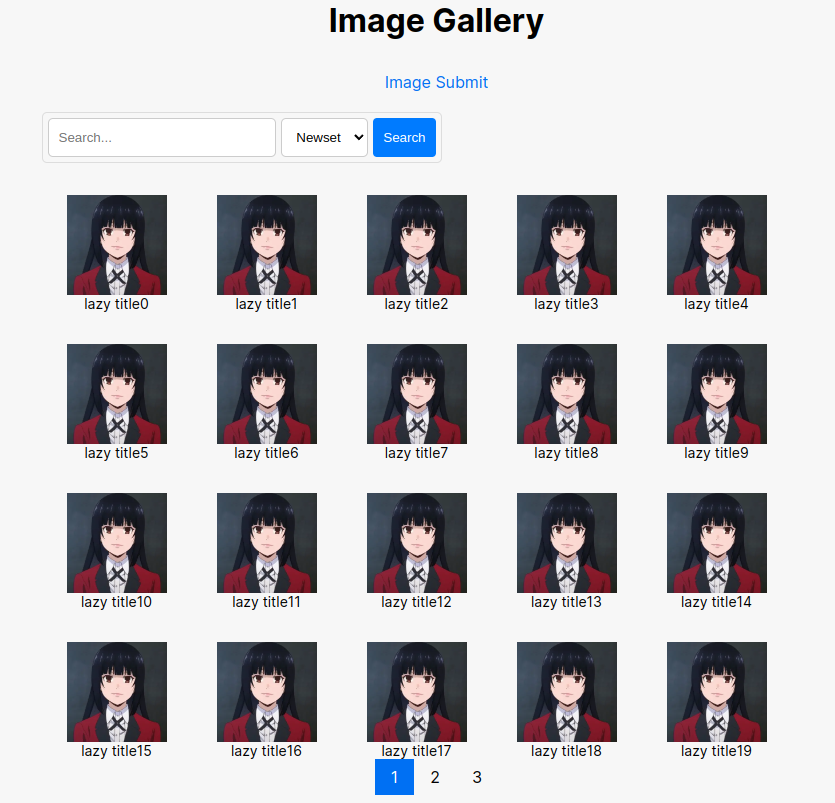
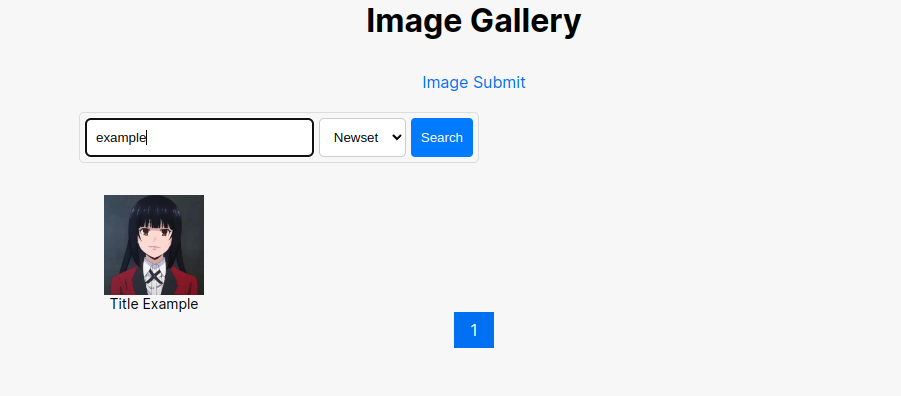
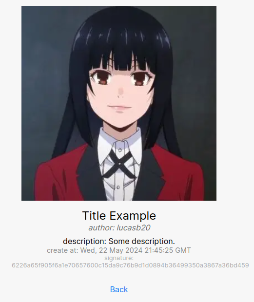

# Image-Gallery
An image gallery app in Nextjs and Flask

**Description**

 This is a web application project to manage images in a gallery.

**Installation instructions**

**System requirements**

* Python 3.x
* Node.js 20.x
* NPM 10.x

**API installation**

1. Enter the backend application folder
2. Run `pip install -r requirements` command to install dependencies
3. Run `flask db create-all` to create all tables in the database
4. Run `flask run` to run development mode

**Frontend application installation**

1. Enter the frontend application folder
2. Run `npm install` to install dependencies
3. Create a .env file with the variable 'NEXT_PUBLIC_API_URL' storing the api address
4. Run `npm run dev` to launch the application in development mode

**Docker Compose**

If you have Docker installed, you can also run the project using Docker Compose.

1. Navigate to the project directory where the `docker-compose.yml` file is located

2. Run `docker-compose up --build` command to build and start the containers

**Screenshots**

- Index page.

- Post Form.

- Search Bar.

- Image detail example.

